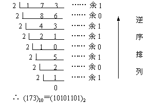
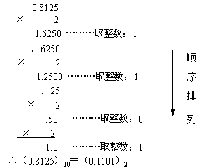

#浮点运算JavaScript
本文主要讨论JavaScript的浮点运算，主要包括
* JavaScript number基本类型
* 二进制表示十进制
* 浮点数的精度
## number 数字类型
在JavaScript中，数字只有number这一种类型;
````
var intS = 2,
    floatA = 0.1;
typeof intS;   // number
typeof floatA; //number
````
那么这个情况下应该很容易理解一件事情：number应该是实现的浮点型数来标识所有的数；
而实际上也是这样；JavaScript的number类型按照ECMA的JavaScript标准，它的Number类型就是IEEE 754的双精度数值，相当于java的double类型。IEEE 754标准《二进制浮点数算法》（www.ieee.org）就是一个对实数进行计算机编码的标准。

<!-- more -->

##十进制转换为二进制
同样，在计算机的世界里，应该是只有二进制数据的，不是0就是1，那么为了表达生活中最为常见的十进制数据，就会有个转换过程；这个就是十进制转换为二进制的方法；
参考：http://www.cnblogs.com/xkfz007/articles/2590472.html 
### 十进制整数转换为二进制
这个情况比较常见：3 =》 01；5 =》101；十进制整数转换为二进制整数采用"除2取余，逆序排列"法。具体做法是：用2去除十进制整数，可以得到一个商和余数；再用2去除商，又会得到一个商和余数，如此进行，直到商为零时为止，然后把先得到的余数作为二进制数的低位有效位，后得到的余数作为二进制数的高位有效位，依次排列起来
换算的法则是，使用一个十进制数字来示例： 173 =》 10101101：



### 十进制小数变为二进制
十进制的小数转换为二进制，0.5 =》 0.1 ；十进制小数转换成二进制小数采用"乘2取整，顺序排列"法。具体做法是：用2乘十进制小数，可以得到积，将积的整数部分取出，再用2乘余下的小数 部分，又得到一个积，再将积的整数部分取出，如此进行，直到积中的小数部分为零，或者达到所要求的精度为止。然后把取出的整数部分按顺序排列起来，先取的整数作为二进制小数的高位有效位，后取的整数作为低位有效位。
示例 0.8125 =》 0.1101



### 完整的十进制小数转为二进制
从上面的讲述中可以知道，一个十进制的小数：173.8125 转换为二进制是 10101101.1101；在计算机中一般都会使用科学计算来处理浮点数，也就是 173.8125 == 1.738125 * 10(2)；那么二进制的表示也不例外，通过指数来定位小数点，用固定的精度来表示数据；

在JavaScript使用的IEEE 754的双精度数值，一个JavaScript的number表示应该是二进制如下格式：
     1[-/+] 11[位指数]        52[数值]                 64位长
    +  -  + -------- + ----------------------- +
64位的具体表述在不同系统可能顺序会有差异，但是都是包含以下三部分：
1. 符号位： 1bit，0表示正数，1表示负数
2. 指数位：11bit，也就是需要移动的位数，也就是指数的大小；由于会存在负数和证书，所以这里用了一个偏移的方式处理，也就是真正的指数+1023，这样的话就表示了【-1023 ~ 1024】；而-1023也就是全0，1024就是全1；
3. 尾数：52bit，这里需要注意的是由于小数点前面以为必须为1，所以实际上是52+1=53位；

参考：http://coolcao.com/2016/10/12/js%E4%B8%AD0-1-0-2%E4%B8%BA%E4%BB%80%E4%B9%88%E4%B8%8D%E7%AD%89%E4%BA%8E0-3/
http://www.cnblogs.com/kingwolfofsky/archive/2011/07/21/2112299.html
可以看到，由于二进制的精确位数只有52+1位，那么类似 1/3 这样的无理数，那么肯定是无法表示的，而且二进制还有很多有理数 0.1这样的也无法在52位精度的范围内表示精确无误；都会被截取53位以后的所有数字。
## 0.1+0.2 !== 0.3  [true]
有了以上的铺垫，那么我们很容易就可以推到出原因了；推理步骤如下：

 十进制0.1 =》 [利用上面说的方法来转换，乘以2取整数，然后顺序获取取出得数]
````
 =>二进制为：0.0001100110011[0011…](循环0011,无限循环)   
 =>指数表示：尾数为1.1001100110011001100…1100（共52位，除了小数点左边的必须为1的数据），指数为-4（-4+1023 = 1019 二进制移码为 01111111011）,符号位为0  
 => 计算机存储为：0 01111111011 10011001100110011…11001  
 => 因为尾数最多52位，所以实际存储的值为0.00011001100110011001100110011001100110011001100110011001  
````
 而十进制0.2  
````
 => 二进制0.0011001100110011…(循环0011)  
 =>尾数为1.1001100110011001100…1100（共52位，除了小数点左边的1），指数为-3（-3+1023=1020二进制移码为01111111100）,符号位为0  
 => 存储为：0 01111111100 10011001100110011…11001  
 因为尾数最多52位，所以实际存储的值为0.00110011001100110011001100110011001100110011001100110011  
````
　那么两者相加得：   
加法运算的时候需要注意以下几点：
* 对阶：需要将指数小的，变得和指数大的一样，通过位数移位【移位注意有一个隐藏的小数点左边的固定的1】
* 尾数运算：加法运算
* 结果规格化：规范为 位数的左边第一位必须为隐藏的1，
* 舍入处理：主要是在截取的时候进行的处理，最后位舍去时为0直接舍去，为1则+1；【有多种舍入处理】
* 溢出判断：

尾数加法运算开始,注意小数点左边隐藏的默认1
       [1].1001100110011001100110011001100110011001100110011001
     + [1].1001100110011001100110011001100110011001100110011001
 //由于0.1是-3阶，指数是-4，而0.2的指数位-3，故而取大者-3；这样0.1需要右移一位，刚好之前小数点左侧隐藏的1被移出来了；如下
          .1100110011001100110011001100110011001100110011001100 【1被舍去】
    +  [1].1001100110011001100110011001100110011001100110011001
    =   100110011001100110011001100110011001100110011001100111
此时阶码变为了 -3，但是由于进位了两位，但是最高位需要保留，故而阶位只是+1，也就是-2了.也就是01111111101，
进行舍入处理，由于最高位一定是1，所以对结果最高位去除，末尾一位去除，由于是1，故而+1处理，得到新的52位位数为：
````
 新的尾数： 0011001100110011001100110011001100110011001100110100
存储为： 0  01111111101  0011001100110011001100110011001100110011001100110100
十进制就是：0.3000000000000000444089209850062616169452667236328125
截取为：   0.30000000000000004  
````
 转换成10进制之后得到:0.30000000000000004   

## 思考
看到 0.1+0.2 = 0.30000000000000004;我开始慌了，那么0.1+0.3 === 0.4 对吗？我也不知道，虽然最后运算的时候证明是对的，但是还是可以按照我们的方法进行分析
````
 十进制0.1  [利用上面说的方法来转换，乘以2取整数，然后顺序获取取出得数]
 =>二进制为：0.0001100110011[0011…](循环0011,无限循环)   
 =>指数表示：尾数为1.1001100110011001100…1100（共52位，除了小数点左边的必须为1的数据），指数为-4（-4+1023 = 1019 二进制移码为 01111111011）,符号位为0  
 => 计算机存储为：0 01111111011 10011001100110011…11001  
 => 因为尾数最多52位，所以实际存储的值为0.00011001100110011001100110011001100110011001100110011001 
 
 而十进制0.3  
 => 二进制0.010011001100110011001100110011001...(循环1001)  
 =>尾数为1.00110011001100110011…0011（共52位，除了小数点左边的1），指数为-2（-2+1023=1021二进制移码为01111111101）,符号位为0  
 => 存储为：0 01111111101 0011001100110011…110011  
 因为尾数最多52位，所以实际存储的值为0.01001100110011001100110011001100110011001100110011001100  

　那么两者相加得[对阶，为大者-2，-4阶数的0.1左移两位]：      
     .0110011001100110011001100110011001100110011001100110
+ [1].0011001100110011001100110011001100110011001100110011　
=   1.1001100110011001100110011001100110011001100110011001

新的尾数： 1001100110011001100110011001100110011001100110011001
存储为： 0  01111111101  1001100110011001100110011001100110011001100110011001
十进制就是：0.39999999999999996447286321199499070644378662109375
截取为：   0.4 
````
可以看到，JavaScript的小数保留了17位，
    //一个52位小数的最小二进制的表示
    0.0000000000000000000000000000000000000000000000000001
    0.0000000000000002220446049250313 
    //一个53【加头部默认1位】位小数的最小二进制数
    0.00000000000000000000000000000000000000000000000000001
    0.00000000000000011102230246251565
    Math.pow(2, 53)
    9007199254740992 //当大于这个数的时候就会丢失精度
    Math.pow(2, -53)
    1.1102230246251565e-16  //当小于这个数也会丢失精度
JavaScript采用了17位来默认截取数据，根据四舍五入方法或者是说二进制中的0舎1进位的方式截取。
所以这样的加法有的时候会出现精度问题，有的又不会。看看具体的情况,在chrome的console里面运行的结果如下：
````
0.4-0.1
0.30000000000000004

0.3+0.1
0.4

0.1+0.2
0.30000000000000004
````
