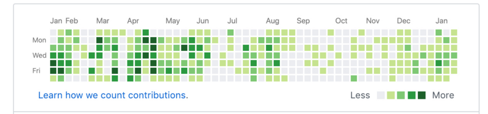

## github contributions

一般而言，任何一个人的`github`主页都有一个这样的方格图；



每一个小格代表了`one day`，不同的颜色深度，代表了不同的`contributions`次数，那么这个次数是怎么计算的呢？本文的翻译就是上图底部的蓝色链接中的[Learn how we count contributions.](https://help.github.com/articles/why-are-my-contributions-not-showing-up-on-my-profile/)

<!-- more -->

## 译文正文
### 为什么我的`contributions`没有在个人`profile`中体现出来？
个人`profile`中的`contributions`绘图是用于记录个人对`github`所做的`contributions`记录，贡献按照协调世界时（UTC）而不是您当地的时区加上时间戳。只有在满足特定标准的情况下才会当做`contributions`计算；在某些情况下，我们可能需要重建您的`contributions`绘图才能显示你的`contributions`。

### 没有被记录的`contributions`
#### `Issues`和`pull requests`
如果`Issues`和`pull requests`只有是在独立仓库中操作的，才会显示在您的`contributions`绘图上，而对于`fork`的仓库无法被记录的。
#### `Commits`
如果`Commits`符合以下所有条件，则会在您的`contributions`绘图上显示：
* 用于`Commits`的电子邮件地址与您的GitHub帐户相关联 
* `Commits`是在独立的仓库中进行的，而不是`fork`
* `Commits`在一下条件下完成
    1. 在仓库的默认分支（通常是`master`）
    2. 在`gh-pages`分支中（对于具有`Project Pages`站点的仓库）
    
此外，必须至少满足下列条件之一：
* 你是该仓库的协作者，或者是这个仓库所属组织的一员；
* 你已经`fork`了该工程
* 你对这个仓库提过`Issues`或者`pull requests`
* 你`star`加星过这个仓库，

### 通常的一些没有被记录的原因
>要显示在您的`contributions`绘图上，共同提交的提交必须符合与一个作者的提交相同的标准。
>当合并`pull requests`并且`Commit`时，只有合并`pull requests`的用户和打开`pull requests`的用户才会收到贡献积分。拉取请求的任何其他贡献者都不会获得贡献积分。
>当重新提交`Commit`时，`Commit`的原始作者和重新提交的人，无论是在命令行还是在`GitHub`上，都会收到贡献信用。
#### `Commit`是在不到24小时前完成
在完成符合要求的`Commit`后，您可能需要等待最多24小时才能看到贡献出现在您的贡献图表上。
#### 您尚未将本地`Git`提交电子邮件添加到您的个人资料中
必须使用已添加到您的GitHub个人资料中的电子邮件地址进行提交，以便显示在您的贡献图表上。您可以通过将.patch添加到提交URL的末尾来检查用于提交的电子邮件地址，例如：
[https://github.com/octocat/octocat.github.io/commit/67c0afc1da354d8571f51b6f0af8f2794117fd10.patch](https://github.com/octocat/octocat.github.io/commit/67c0afc1da354d8571f51b6f0af8f2794117fd10.patch)
````
From 67c0afc1da354d8571f51b6f0af8f2794117fd10 Mon Sep 17 00:00:00 2001
From: The Octocat <octocat@nowhere.com>
Date: Sun, 27 Apr 2014 15:36:39 +0530
Subject: [PATCH] updated index for better welcome message
````
可以配合：
查看email：`git config --global user.email `
设置email：`git config --global user.email XXXX@gmail.com`

#### 未在默认`master`或`gh-pages`分支中进行提交
只有在默认分支（通常为`master`）或`gh-pages`分支（对于具有`Project Pages`站点的存储库）中进行提交时才会计算提交。
#### 提交共同作者无权访问存储库
如果在共同作者无权访问的存储库中进行了提交，则该提交将不计入共同作者的贡献。
#### 提交是在一个`fork`分支中进行的
用`fork`做的提交不会计入你的贡献。要使它们计数，您必须执行以下操作之一：
* 打开`pull requests`以将更改合并到父存储库中。
* 要分离`fork`并将其转换为`GitHub`上的独立存储库，请联系`GitHub`支持或`GitHub Premium`支持。如果`fork`具有自己的分支，请让支持知道分支是否应随存储库移动到新网络中或保留在当前网络中。
#### `Commit`是在合并和压缩的`pull requests`中完成的
合并和压缩的`pull requests`中的`Commit`将不计入您的贡献。只有合并`pull requests`的用户和打开`pull requests`的用户才会收到贡献积分。拉取请求的任何其他贡献者都不会获得贡献积分。