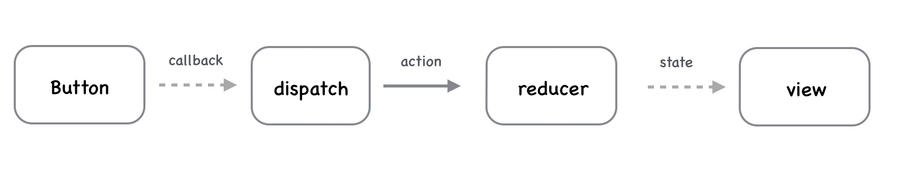
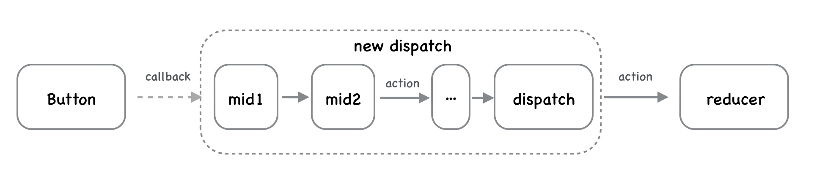
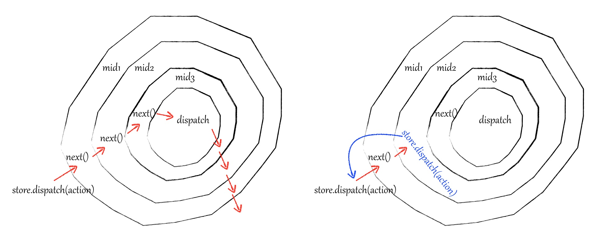

## redux的中间件
>It provides a third-party extension point between dispatching an action, and the moment it reaches the reducer.

这是 redux 作者 Dan 对 middleware 的描述，middleware 提供了一个分类处理 action 的机会，在 middleware 中你可以检阅每一个流过的 action，挑选出特定类型的 action 进行相应操作，给你一次改变 action 的机会。

### redux使用中间件机制的动机
redux是一个单向数据流库， 下图是redux中一个简单的同步单向数据流动的场景，点击 button 后，在回调中 dispatch 一个 action，reducer 收到 action 后，更新 state 并通知 view 重新渲染。单向数据流，



在开发者使用的时候并没有什么问题，如果在复杂场景中，我们再dispatch 一个 action的时候需要去服务端获取数据，并且需要打印请求发起reque记录和请求结果response记录，如果只是修改某一次的dispatch，那么其他我们直接修改就好了，但是如果每一次的dispatch都需要被记录呢？如果还是在原来的代码中添加的话，那么将会变得不可控，意于是redux 作者 Dan引入了 middleware，



这种模式就是可以组合的，自由插拔的插件机制，借鉴于KOA的中间件思想，使用 middleware 来增强 dispatch ，完成我们需要的一些功能。

## 简单实现思路
为了能够实现上述的中间件机制，我们需要清楚整个过程中发生了什么，以及我们需要实现什么，

正常的dispatch一个action的时候，我们认为是如下行为：
````
----- dispatch(action)||dispatch(createrAction()) -----
````
引入了middleware之后我们就需要去实现如下行为：`applyMiddleware(MidA, MidB, MidC, MidD)`
````
--->MidA
        --->MidB
                --->MidC
                        --->MidD
                                <-->dispatch(action)||dispatch(createrAction())
                        <---MidD
                <---MidC
        <---MidB
<---MidA
````
可以看到是会顺序执行Middleware，可以看到第一个中间件MidA执行中会调用MidB，而MidB运行中调用了MidC，而MidC运行中调用了MidD，MidD执行后是最后一个中间件，所以会执行dispatch的原来内容，完成后返回到MidD的执行上下文，而MidD执行完成后又会回到MidC上下文，在MidC执行完成后，会返回到调用MidC的MidB执行上下文中，最后回到最开始调用的中间件MidA中，执行完成MidA后整个机制就完成了；

为了实现这种效果，如下细节需要注意：
1. 我们需要规定一下这些中间件的格式，
2. 首先中间件必须是一个函数方便调用，`() => {}`
3. 其次函数中必须有一个参数用来调用下一个中间件函数，还需要这个dispatch这个方法需要的参数action，或者说是中间件整个机制的上下文：
    ````js
    const MidA = (action, next) => { 
        // 做一些MidA插件需要干的事 比如添加 log等
        log('start log')
        next(action); // 调用下一个中间件
        log('end log')
    }
    ````

有了上面的基础了解，我们知道了最后整体的实现后的结果就是这样的：
````js
const MidA = (action, next) => { 
    // 做一些MidA插件需要干的事 比如添加 log等
    log('start log AAAA', action)
    next(action); // 调用下一个中间件
    log('end log AAAA', action)
}
const MidB = (action, next) => { 
    // 做一些MidA插件需要干的事 比如添加 log等
    log('start log BBBB', action)
    next(action); // 调用下一个中间件
    log('end log BBBB', action)
}
const MidC = (action, next) => { 
    // 做一些MidA插件需要干的事 比如添加 log等
    log('start log CCCC', action)
    next(action); // 调用下一个中间件
    log('end log CCCC', action)
}

const midStack = applyMiddleware(MidA, MidB, MidC);
// 这里applyMiddleware需要得到的函数 midStack 是这样的函数：
midStack = (action, nextFunc = (action) => dispatch(action)) => {
    MidA(action, (action) => {
        MidB(action, (action) => {
            MidC(action, (action) => {
                nextFunc(action);
            })
        });
    })
};
// 通过 midStack(action, (action) => dispatch(action)) 或者直接 midStack(action) 可以达到上面的中间件机制的目的。
````
为了实现上面的这种嵌套格式(特别是在中间件较多的时候写起来很别扭)，需要封装一个applyMiddleware函数；
````js
const applyMiddleware = (...mids) => {
    const [MidA, MidB, MidC] = mids;
    if(mids.length === 1) {
        return (action) =>  MidA(action, (action) => {
                dispatch(action);
            });
    }
    const midStack = mids.reduce((preMid, nextMid) => {
        // 每次返回一个和中间件的格式一致的函数 以便递归调用
        return (action, nextFunc = (action) => dispatch(action)) => {
            preMid(action, (action) => {
                nextMid(action, nextFunc);
            })
        }
    });
    return midStack;
}
````
上面通过使用reduce来把中间件嵌套成所希望的格式，就可以按照需要的顺序来完成调用。但是看起来还是有一点的难理解，需要多琢磨一下，然后这块的写法还可以在优化一下；
````js
const applyMiddleware = (...mids) => {
    const [MidA, MidB, MidC] = mids;
    if(mids.length === 1) {
        return (action) =>  MidA(action, (action) => {
                dispatch(action);
            });
    }
    const midStack = (action, nextFunc = (action) => dispatch(action)) => {
        return mids.reduceRight((preMid, nextMid) => {
            return nextMid.bind(null, action, preMid);
        }, nextFunc)();
    }
    return midStack;
}
````

### redux的中间件具体实现思路
[参考redux的介绍](https://redux.js.org/advanced/middleware)，前面提到使用 middleware 来增强 dispatch ，完成我们需要的一些功能。那么我们一步一步来看看redux 是怎么来解决这个问题的。

我们需要一个对dispatch进行log日志记录的功能，我们可能会考虑在dispatch的前后加上log，如下：
````js
const action = addTodo('Use Redux')

console.log('dispatching', action)
store.dispatch(action)
console.log('next state', store.getState())
````
如果每个调用dispatch的地方都需要记录log，那么我们可以考虑封装一下这个dispatch为dispatchLog：
````js
function dispatchAndLog(store, action) {
  console.log('dispatching', action)
  store.dispatch(action)
  console.log('next state', store.getState())
}

// 需要调用的地方这么使用即可完成统一封装
dispatchAndLog(store, addTodo('Use Redux'))
````
我们甚至还可以做得更加深入一点，直接使用dispatchAndLog替换store对象中的dispatch方法：
````js
const next = store.dispatch
store.dispatch = function dispatchAndLog(action) {
  console.log('dispatching', action)
  let result = next(action)
  console.log('next state', store.getState())
  return result
}

// 正常调用替换后的store.dispatch
store.dispatch(action)
````

看起来很接近了，可是如果我们再dispatch里面处理需要记录log以外，还需要针对某一部分的dispatch进行一个监控上报，为了保证两个功能相互独立，我们可以考虑写成两个独立的函数中：
````js
// log 记录
function patchStoreToAddLogging(store) {
  const next = store.dispatch
  store.dispatch = function dispatchAndLog(action) {
    console.log('dispatching', action)
    let result = next(action)
    console.log('next state', store.getState())
    return result
  }
}
patchStoreToAddLogging(store)

// 监控上报
function patchStoreToAddLogging(store) {
  const next = store.dispatch
  store.dispatch = function dispatchAndLog(action) {
    // 错误监控上报
    if(action.type === 'ERROR') {
        fetch(url, {}).then( res => res.json()).then(data => {
            let result = next(action)
            return result
        });
    } else {
        let result = next(action)
        return result
    }
  }
}
patchStoreToAddCrashReporting(store)

````

上面的这种直接修改store.dispatch的方法还是有点笨重，我们可以考虑不是直接替换store.dispatch，而是返回一个新的dispatch：
````js
function logger(store) {
  const next = store.dispatch

  // Previously:
  // store.dispatch = function dispatchAndLog(action) {

  return function dispatchAndLog(action) {
    console.log('dispatching', action)
    let result = next(action)
    console.log('next state', store.getState())
    return result
  }
}

````
可以配合redux的API来进行搭配使用：
````js
function applyMiddlewareByMonkeypatching(store, middlewares) {
  middlewares = middlewares.slice()
  middlewares.reverse()

  // Transform dispatch function with each middleware.
  middlewares.forEach(middleware => (store.dispatch = middleware(store)))
}

// 使用多个Middleware
applyMiddlewareByMonkeypatching(store, [logger, crashReporter])
````

这样看起来就好了很多，多个middleware之间可以很好地顺序执行，已经可以完成我们需要的功能，但是实际的代码还做了一些优化；

上面的代码中，无论是在patchStoreToAddLogging还是在applyMiddlewareByMonkeypatching中，我们都做了一件事情，就是重写store.dispatch，因为需要middleware来增强dispatch，方便后面统一调用；同时对于多个middleware的情况，重写store.dispatch还可以让顺序执行的middleware能够获取到上一个middleware所重写的最新的store.dispatch，这对于链式调用middleware而言是必要的，而优化的点就是重写store.dispatch这块，我们的middleware每次都是从store获取最新的dispatch，我们可以把第一次的store.dispatch提取出来，然后每个middleware都来修改这个提取后的dispatch【next】,直到最后一个middleware修改完，再来重写覆盖最原始的store.dispatch，也就是提取一个next函数来作为每个middleware需要获取的最新的dispatch，类似如下：
````js
function logger(store) {
  return function wrapDispatchToAddLogging(next) {
    return function dispatchAndLog(action) {
      console.log('dispatching', action)
      let result = next(action)
      console.log('next state', store.getState())
      return result
    }
  }
}

````

当然我们还可以使用箭头函数来简化：
````js
const logger = store => next => action => {
  console.log('dispatching', action)
  let result = next(action)
  console.log('next state', store.getState())
  return result
}

const postError = store => next => action => {
  // 错误监控上报
    if(action.type === 'ERROR') {
        fetch(url, {}).then( res => res.json()).then(data => {
            let result = next(action)
            return result
        });
    } else {
        let result = next(action)
        return result
    }
}

// 配合applyMiddleware 
function applyMiddleware(store, middlewares) {
  middlewares = middlewares.slice()
  middlewares.reverse()
  let dispatch = store.dispatch
  middlewares.forEach(middleware => (dispatch = middleware(store)(dispatch)))
  return Object.assign({}, store, { dispatch })
}

````

到了这里其实基本就差不多了，但是还是和实际的源码不太一致，等待继续解读。


正常情况下，如图左，当我们 dispatch 一个 action 时，middleware 通过 next(action) 一层一层处理和传递 action 直到 redux 原生的 dispatch。如果某个 middleware 使用 store.dispatch(action) 来分发 action，就发生了右图的情况，相当于从外层重新来一遍，这也是redux-thunk的源码利用的地方。

## redux中间件机制源码


